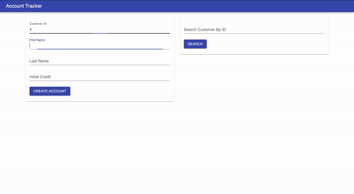

# Account Tracker

The account tracker built using ReactJS and Node is a tool that can create customer accounts and search customer accounts.

## Table of Contents

-   [Demo](#demo)
-   [Requirments](#requirments)
-   [Install](#install)
-   [Run](#run)
-   [Maintainers](#maintainers)
-   [License](#license)

## Demo



## Requirments

-   NodeJS >=v14.17.0

## Install

Clone the repo then run the following command.

```shell
$ npm install
```

## Run

```shell
$ npm start
```

## Maintainers

-   [Abdul Amoud](https://github.com/abdu997)

## License

[MIT](LICENSE) © Abdul Rahman Amoud
